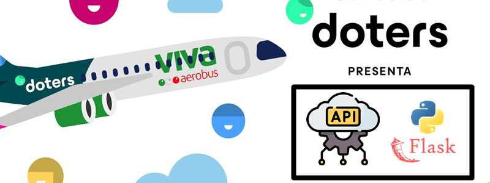

<h1 align="center"> FelipedelosH </h1>
<br>
<h4>Fake DOTERS PYTHON FLASK SERVER</h4>


<br>
:construction: Status of project :construction:
<br><br>
Lorem ipsum dolor sit amet, consectetur adipiscing elit, sed do eiusmod tempor incididunt ut labore et dolore magna aliqua. Ut enim ad minim veniam, quis nostrud exercitation ullamco laboris nisi ut aliquip ex ea commodo consequat. Duis aute irure dolor in reprehenderit in voluptate velit esse cillum dolore eu fugiat nulla pariatur. Excepteur sint occaecat cupidatat non proident, sunt in culpa qui officia deserunt mollit anim id est laborum.

## :hammer:Funtions:

- `Function 1`: Neque porro quisquam est qui dolorem ipsum quia dolor sit amet.<br>
- `Function 2`: Neque porro quisquam est qui dolorem ipsum quia dolor sit amet.<br>
- `Function 3`: Neque porro quisquam est qui dolorem ipsum quia dolor sit amet.<br>
- `Function 3a`: Neque porro quisquam est qui dolorem ipsum quia dolor sit amet.<br>
- `Function 4`: Neque porro quisquam est qui dolorem ipsum quia dolor sit amet.<br>


## Architecture

```
FakeServerDOTERS/
├─ app/
│  ├─ controllers/
│  │  └─ 
│  ├─ Database/
│  │  └─
│  ├─ helpers/
│  │  └─ 
│  ├─ models/
│  │  └─ 
│  ├─ repositories/
│  │  └─ 
│  ├─ services/
│  │  └─ 
│  │  UseCases/
│  │  └─ 
│  ├─ __init__.py
│  └─ routes.py
│
├─ DB/
├─ .gitignore
├─ readme.md
├─ requirements.txt
└─ run.py
```

## Install requirements.txt


```
C:\Users\docto\AppData\Local\Programs\Python\Python313\python.exe -m pip install -r requirements.txt
```
```
pip install -r requirements.txt
```

## :play_or_pause_button:How to execute a project

```
C:\Users\docto\AppData\Local\Programs\Python\Python313\python.exe run.py
```
```
python run.py
```

## Endpoints

| Endpoint | Method | Description |
|-----------|---------|-------------|
| `/health` | GET | Check server status |
| `/v1/security/login` | POST | Generate authentication token |
| `/v1/security/generate-otp` | POST | Generate OTP for member |
| `/v1/member-transactions/points/accrual/delivery` | POST | Accrue points |
| `/v1/member-transactions/points/simulate/delivery` | POST | Simulate points accrual |
| `/v1/member-transactions/points/redemption/delivery` | POST | Redeem points |
| `/v1/member-transactions/points/redemption/simulate/delivery` | POST | Simulate redemption |
| `/v1/member-transactions/points/cancel-transaction` | POST | Cancel a transaction |
| `/v2/member-transactions/rates` | GET | Get exchange rate |
| `/v1/member-account/link/rappi` | POST | Link Rappi and Doters accounts |
| `/v1/member-account/unlink/rappi` | POST | Unlink Rappi and Doters accounts |
| `/v2/user/signup` | POST | Automatic user signup |


## :hammer_and_wrench:Tech.

- Python
- Flask

## :warning:Warning.

- limitations.

## Autor

| [<br><sub>Andrés Felipe Hernánez</sub>](https://github.com/felipedelosh)|
| :---: |